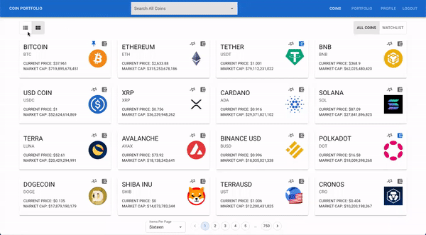
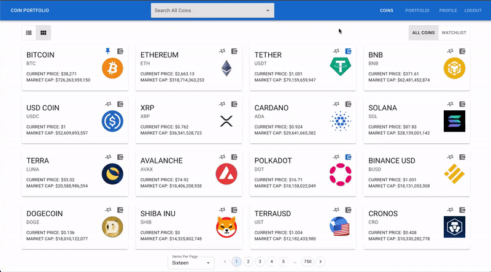
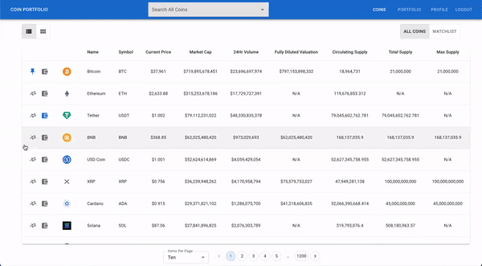
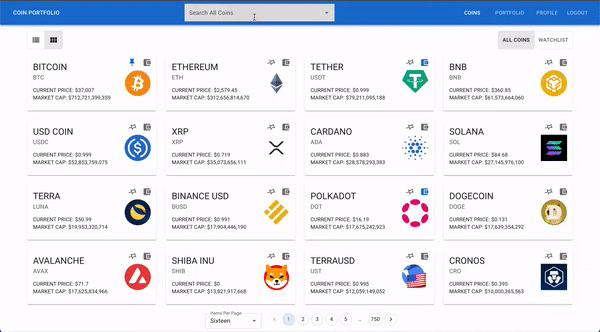

# Capstone2 - Frontend

[**Capstone Proposal**](https://docs.google.com/document/d/15wQMVok6QCMfPjg0Qaucn1m6866qoDvtEbIkYkT6Vew/edit?usp=sharing)

# Coin Portfolio

Coin Portfolio a web application designed for people who are interested in cryptocurrencies' market. The goal is to have a place to watch any coin and track the amount of each coin they have in their portfolio.  
[**Click here to visit Coin Portfolio!**](https://portfolio-coin.surge.sh/)

## Features:

- Sign up for a new account.
- Authenticate users.
- Search and view Coins in table, graph or card views.
- Pin coins to their watchlist.
- Add coins to their portfolio.
- View a dashboard of their portfolio.

## API:

The [**CoinGecko API**](https://www.coingecko.com/en/api/documentation) was used for this project.

- Since CoinGecko's API does not include a search endpoint, endpoint "Coins List" was used to seed my database with 9,000 of the existing coins, with the limitation of Heroku's free postgres database service allowing up to 10,000 rows.
- Endpoint "Coins Markets" populates the coin table and card information, whereas endpoint "Coins ID Market Chart" populates the chart data points.

My [**Backend API**](https://github.com/VirginiaWu11/Capstone2-Backend) was also used in this application.

- In addition to the list of 9,000 coins mentioned above, my backend is also storing the user sign in, watchlist, and portfolio information.
- Flask-JWT and Flask Bcrypt are used to authenticate the user.

## App Navigation:

- When the user first opens the page, the user has the option to sign up for an account or sign into an existing account.  
  The user must be signed in to view the rest of the application.
- Once the user is signed in, the user will be redirected to the `Coins` tab which shows all cryptocurrencies in cards displayed sorted by highest market cap first. On the top left section of the screen, the user is able to toggle between table view and card view.
- Both views have a push pin icon button near the coin logo to pin or unpin the coin to/from their watchlist and a wallet icon button to add or remove coin to/from their portfolio.
- If the user clicks on the coin card or table row itself, a modal will pop up, displaying a chart and more information about the coin. Within the modal, the user can also select the amount of days of data the chart should display.
- At the bottom of the page, the user is able to go to the next page, go back, or select a page number to navigate to.
- When the user has pinned a coin to their watchlist, they can then go to the watchlist toggle on the top right corner which would show only the coins which are pinned.
- There is also a search bar on the navigation bar which allows the user to search for a specific coin. Clicking on a coin from the search bar would open the same modal as clicking on a coin from the `Coins` tab.
- The user can also go to the `Portfolio` tab which would display a dashboard of the status of their current portfolio. This includes a summary at the top for the total portfolio value, the change in an hour, a day, and seven days, a line chart, a pie chart, and also a table display of all their coins.

&nbsp;

### Coins Tab

&nbsp;

#### Card View

&nbsp;

#### Table View

&nbsp;

#### All/Watchlist Coins

&nbsp;

### Modal Chart Popup

&nbsp;

### Portfolio Tab

&nbsp;

### Search Bar

&nbsp;

## Future goals:

- Add feature sort coins table.
- A chron job to be added to the backend to keep the database coins updated as there are more coins in the market.
- Add an emailing alert feather for when the user's portfolio amount changes significantly.

## Technology Stack Used:

- Python
- Javascript
- PostgreSQL
- Flask
- SQL Alchemy
- Flask-Bcrypt
- Flask-JWT
- Material UI
- Formik
- Yup
- React JS
- HTML
- CSS
- React ChartJS 2
- lodash
- moment
- [**CoinGecko API**](https://www.coingecko.com/en/api/documentation)
